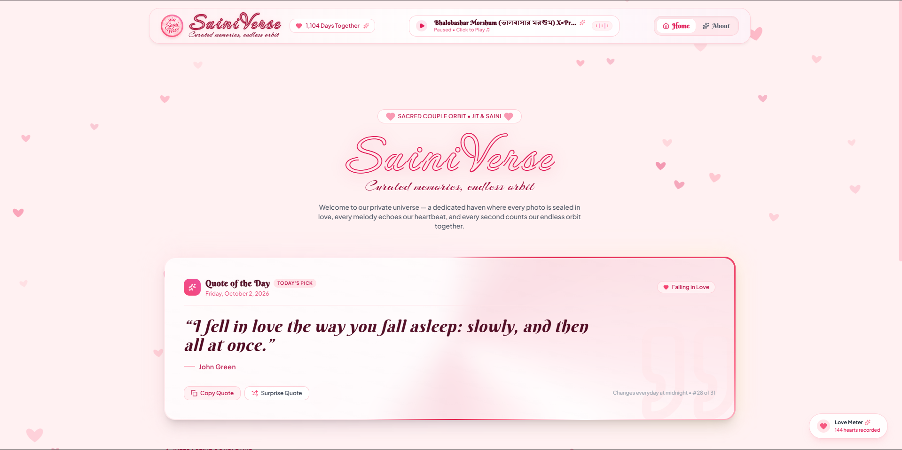

  

# SainiVerse — Our Private Cosmic Memory Vault

---

---

## 📖 About

**SainiVerse** is an exclusive, full-stack private digital sanctuary designed to archive milestones, shared stories, and uncompressed memories for Jit and Saini. Built on Zero-Knowledge security principles, the platform pairs dual-layer Cloudflare R2 bucket partitioning with Firebase-authenticated access control. It features an integrated Gemini AI vision pipeline tailored to produce contextual, short, and bilingual (English & Bengali) captioning directly from uploaded photos.

---

## ⚡ Built With

---

## ✨ Features

<table>
<tr>
<td width="50%">

### 🔒 Zero-Knowledge Memory Vault

- 🛡️ **Dual R2 Partitioning**: Physical isolation for `Public_Memory/` and `Private_Memory/`
- ⏳ **60-Second Presigned PUTs**: Upload directly to Cloudflare without server payload limits
- 🚫 **Anti-Scraping Image Protection**: Custom context menus, drag locks, and tokenized stream pipelines
- ⚡ **Bounded LRU Memory Cache**: Fast local rendering capped at 40 media objects

</td>
<td width="50%">

### ✨ AI Vision & Experience

- 🤖 **Gemini Flash Vision**: Sassy, short, contextually anchored caption generation
- 🌸 **Bilingual Expressions**: Seamless English & Bengali (বাংলা) micro-poetry
- 📸 **Client-Side Compression**: Real-time canvas downscaling avoiding edge network timeouts
- 📱 **Fluid Responsive UI**: Glassmorphic dark aesthetic optimized across desktop and mobile

</td>
</tr>
<tr>
<td colspan="2" align="center">

### 🔐 Strict Whitelist Authentication

Granular Firestore Security Rules &nbsp;•&nbsp; Bi-Party Access Locks &nbsp;•&nbsp; Immutable Audit Timestamps

</td>
</tr>
</table>

---

## 👥 Authors

| Name      | GitHub                                           | Email                                                                                                                           |
| --------- | ------------------------------------------------ | ------------------------------------------------------------------------------------------------------------------------------- |
| Jit Hazra | [@Jit-codes-ez](https://github.com/Jit-codes-ez) |  |

---

## 📬 Contact

---

### ⭐ Locked in Forever

A small piece of eternity preserved in code, light, and pixels.

---
